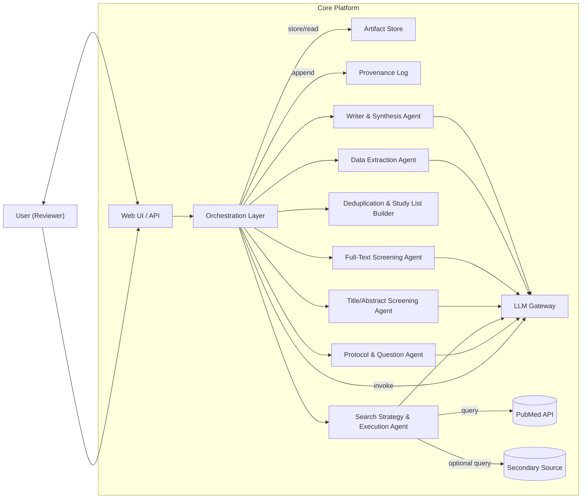
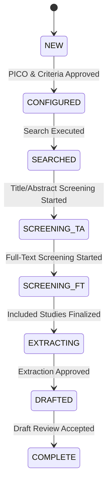

# MVP Architecture Document  
**Multi‑Agent LLM System for Systematic Reviews (MVP / Proof‑of‑Concept)**

---

## 1. Overview

This document describes the architecture of a Minimum Viable Product (MVP) / Proof‑of‑Concept system that uses LLM‑based agents to support the creation of systematic review articles.

Given a single high‑level research question, the system:

- Guides the user to a structured PICO and eligibility criteria.
- Designs and executes basic literature searches against 1–2 sources.
- Deduplicates search results into a study list.
- Supports human title/abstract and full‑text screening with AI suggestions.
- Extracts key qualitative information and simple numerics.
- Produces a narrative review draft and a basic PRISMA‑style flow summary.

The MVP is intentionally **non‑regulatory** and omits advanced statistical guarantees, formal stopping rules, and complex governance from the full architecture. It is designed as a foundation that can be hardened later.

---

## 2. Scope

### 2.1 In‑Scope (MVP)

- Single‑user, single‑project workflow.
- English‑language literature only.
- One or two bibliographic sources (e.g., PubMed + OpenAlex/Crossref).
- Manual upload of PDFs where automatic retrieval fails.
- Qualitative‑first synthesis; optional, limited use of directly reported summary numerics.
- Basic provenance and replay (re‑generation of drafts from stored artifacts).

### 2.2 Out‑of‑Scope (MVP)

- Formal validation of sensitivity/recall, statistical stopping rules, IPW, capture–recapture.
- Symbolic numeric validation and advanced unit/variance conversions.
- Risk‑of‑bias (RoB) tools and GRADE.
- Full meta‑analysis pipelines and zero‑event handling.
- PRISMA‑DFLLM, AIS, and regulator‑grade governance.
- Multi‑tenant security hardening and complex deployment topologies.

---

## 3. System Context

### 3.1 External Systems

- **Literature Sources**
  - PubMed (primary).
  - Optional secondary index (e.g., OpenAlex or Crossref).

- **Full‑Text Sources**
  - PubMed Central OA where available.
  - DOI → OA resolvers (e.g., via OpenAlex/Crossref).
  - User‑uploaded PDFs.

### 3.2 Users

- **Review User**
  - Responsible for:
    - PICO and eligibility definition.
    - Approval of search strings.
    - Final screening decisions.
    - Verification of extracted data.
    - Revision and acceptance of the draft review.

---

## 4. High‑Level Architecture

### 4.1 Component Overview

- **Web UI / API**
  - Review creation and configuration.
  - Step‑by‑step workflow (question structuring → search → screening → extraction → writing).
  - Visualization of screening lists and extracted data.
  - Document preview and editing of the review draft.

- **Orchestration Layer**
  - State machine / simple DAG controller for each review.
  - Tracks current step and available actions.
  - Invokes agents and services, updates review state.

- **LLM Gateway**
  - Unified interface to 1–3 LLM models.
  - Handles prompt templating, model selection, parameter configuration, and logging.

- **Agents / Services**
  - Protocol & Question Structuring Agent.
  - Search Strategy & Execution Agent.
  - Deduplication & Study List Builder.
  - Title/Abstract Screening Agent.
  - Full‑Text Screening Agent.
  - Data Extraction Agent.
  - Writer & Synthesis Agent.

- **Artifact Store**
  - Persistent storage for:
    - Review config.
    - Search results.
    - Deduplicated study list.
    - Screening decisions.
    - Extracted study data.
    - PDF files.
    - Generated drafts.

- **Provenance Log**
  - Append‑only log of key events and decisions.
  - Stores references to artifacts and LLM calls.

### 4.2 High‑Level Diagram (Mermaid)

---

## 5. Review Run Configuration (MVP)

Each review has a **Review Config** document (JSON) capturing:

- Basic metadata:
  - Review ID, title, description.
  - Creation date and user.

- Method setup:
  - PICO elements (Population, Intervention/Exposure, Comparator, Outcomes).
  - Free‑text inclusion/exclusion criteria.
  - Selected sources/databases.
  - Final search strings and dates.

- Technical setup:
  - LLM model identifiers and decoding parameters (temperature, max tokens, etc.).
  - Prompt template versions per agent type.

### 5.1 Config Lifecycle

- **Draft Phase** (Before Screening Starts)
  - User can edit PICO, criteria, sources, search strings.
  - Re‑running question structuring or search overwrites draft artifacts.

- **Frozen Phase** (After Screening Starts)
  - Config snapshot is frozen and versioned for this run.
  - Changes require explicit confirmation and create a new run with a new config ID.
  - Previous runs remain accessible but read‑only.

---

## 6. Detailed Component Design

### 6.1 Orchestration Layer

- **Responsibilities**
  - Maintain finite‑state machine for each review:
    - `NEW → CONFIGURED → SEARCHED → SCREENING_TA → SCREENING_FT → EXTRACTING → DRAFTED → COMPLETE`
  - Enforce step ordering and prerequisites.
  - Coordinate calls to:
    - Agents (via synchronous RPC or asynchronous tasks).
    - Artifact Store.
    - Provenance Log.

- **State Model (Mermaid)**

- **Interfaces**
  - `start_step(review_id, step)`
  - `get_state(review_id)`
  - `register_completion(review_id, step, artifacts)`

---

### 6.2 LLM Gateway

- **Responsibilities**
  - Provide a single interface such as:
    - `invoke(model_id, prompt_template_id, variables, decoding_params) → LLMResponse`
  - Log:
    - Model ID and version.
    - Prompt template and variables.
    - Key outputs (truncated, if necessary).
    - Call metadata (latency, timestamp, calling agent).

- **Simplifications**
  - No complex routing logic between regulatory/productivity stacks.
  - Small set of allowed model IDs.

---

### 6.3 Protocol & Question Structuring Agent

- **Inputs**
  - Free‑text research question and context from user.

- **Processing**
  - Uses LLM to transform question into:
    - Draft PICO structure.
    - Suggested inclusion/exclusion criteria.
    - Brief protocol summary.

- **Outputs**
  - `PICO` object.
  - `eligibility_criteria` object (inclusion & exclusion).
  - `protocol_summary` text.

- **Interactions**
  - LLM Gateway for transformation.
  - Artifact Store for storing outputs.
  - Provenance Log for recording interaction and user approvals.

---

### 6.4 Search Strategy & Execution Agent

- **Inputs**
  - PICO and eligibility from Review Config.

- **Processing**
  - Generate suggested keyword lists and Boolean search strings.
  - Present search strings to user for editing/approval via UI.
  - Execute approved queries against:
    - PubMed API.
    - Optional secondary source (e.g., OpenAlex or Crossref).

- **Outputs**
  - Final search strings per source.
  - Raw search result dumps (JSON).
  - Simple summary: record count per source and date.

- **Interactions**
  - LLM Gateway for search string generation.
  - External source APIs.
  - Artifact Store and Provenance Log.

---

### 6.5 Deduplication & Study List Builder

- **Inputs**
  - Raw record lists from one or more sources.

- **Processing (Minimal)**
  - Normalize titles (case, punctuation).
  - Use deterministic identifiers where available (e.g., DOI, PMID).
  - Fuzzy match on title + first author + year.
  - For ambiguous potential duplicates, flag for manual user resolution.

- **Outputs**
  - `StudyList`:
    - Internal `study_id`.
    - Canonical bibliographic record per study.
    - Mapping from raw record IDs to `study_id`.

- **Interactions**
  - Artifact Store for input/output.
  - Provenance Log to record deduplication decisions (including manual merges/splits).

---

### 6.6 Title/Abstract Screening Agent

- **Inputs**
  - Deduplicated study list.
  - PICO and eligibility criteria.

- **Processing**
  - For each record:
    - Construct prompt with title/abstract + criteria.
    - Obtain LLM suggestion: `include`, `exclude`, or `unsure` + rationale.
  - Provide UI for user to:
    - View suggestion and rationale.
    - Select final decision.
    - Optionally filter/sort by AI “priority”/score.

- **Outputs**
  - Screening table:
    - `study_id`
    - AI suggestion + rationale.
    - Human decision (include/exclude/unsure).
    - Optional comment.
    - Timestamps.

- **Constraints (MVP)**
  - No statistical stopping; all records are processed.
  - AI suggestions are advisory only.

---

### 6.7 Full‑Text Retrieval & Screening Agent

- **Inputs**
  - Studies marked `include` or `unsure` after title/abstract screening.

- **Processing**

  1. **Retrieval**
     - Attempt automatic retrieval via:
       - PubMed Central or OA links where available.
       - Optional DOI resolution.
     - If retrieval fails:
       - UI prompts user to upload the PDF.

  2. **Full‑Text Screening**
     - For each available PDF:
       - Use a VLM or LLM with OCR to parse content.
       - Extract key snippets for:
         - Population.
         - Intervention/comparator.
         - Outcomes.
         - Study design.
       - Produce AI recommendation: include/exclude/unsure with snippet references.

  - UI allows user to:
    - View snippets and recommendations.
    - Make final full‑text decision.

- **Outputs**
  - Full‑text screening table per study:
    - Availability of PDF.
    - AI recommendation + rationale.
    - Human final decision.

- **Simplifications**
  - Single model pass per document (no triple‑ensemble).
  - Fallback to “ask user to correct/annotate” if parsing fails.

---

### 6.8 Data Extraction Agent (Qualitative‑First)

- **Inputs**
  - List of included studies after full‑text screening.
  - Associated PDFs.

- **Processing**
  - For each included study:
    - Use LLM/VLM to extract a structured summary:
      - Study design.
      - Population description (including N, if straightforward).
      - Intervention(s)/comparator(s).
      - Outcomes measured.
      - Major results and main reported effects (key sentences; directly reported effect sizes/CI if clear).
      - Limitations or quality notes (descriptive).
    - Present extraction to user for confirmation and editing.

- **Outputs**
  - Structured `ExtractedStudyData` per study (JSON).
  - Optional human‑edited notes.

- **Constraints (MVP)**
  - Minimal numeric handling:
    - No derived effect sizes or conversions.
    - No symbolic arithmetic checks.
  - Focus is on usable qualitative summaries and directly reported summary statistics.

---

### 6.9 Writer & Synthesis Agent

- **Inputs**
  - Review Config (PICO, eligibility).
  - Search summary (sources, strings, dates, record counts).
  - Screening artifacts (counts at each stage).
  - Extracted study data.

- **Processing**
  - Generate structured text sections:

    1. **Introduction**
       - Background and rationale for the topic.
    2. **Methods**
       - PICO and eligibility criteria.
       - Databases searched and dates.
       - High‑level screening process (AI‑assisted, human‑final).
    3. **Results**
       - PRISMA‑style flow text: numbers identified, deduplicated, screened, full‑text assessed, and included.
       - Narrative description of included studies (possibly with a rendered table).
       - Thematic qualitative synthesis by outcome/subtopic.
    4. **Discussion**
       - Summary of main findings.
       - Limitations of the evidence.
       - Limitations of the MVP system and AI assistance.
    5. **Conclusion**
       - High‑level takeaways and research implications.

  - Generate formatted references using bibliographic data.

- **Outputs**
  - Review draft (e.g., as Markdown or DOCX‑ready HTML).
  - Optional tables (e.g., “Characteristics of included studies”).

- **Reproducibility**
  - Operates solely on stored artifacts and config.
  - Can run in a deterministic mode (fixed temperature) for bit‑stable drafts if required.

---

## 7. Artifact Store & Data Model (MVP)

### 7.1 Artifact Types

- `ReviewConfig`
- `SearchResultSet` (per source)
- `StudyList` & `DedupMap`
- `TitleAbstractScreeningTable`
- `FullTextScreeningTable`
- `ExtractedStudyDataSet`
- `ReviewDraft`
- `PDFDocument` (per study)

### 7.2 Storage Requirements

- Versioned per review and per major step.
- Lightweight metadata indexing to:
  - Quickly list studies and their statuses.
  - Retrieve all artifacts needed for end‑to‑end replay.

---

## 8. Provenance Logging (MVP)

- **Log Entry Fields**
  - `review_id`
  - `timestamp`
  - `actor_type` (user / system / agent name)
  - `operation` (e.g., “search_executed”, “screening_decision_made”)
  - `input_artifact_ids`
  - `output_artifact_ids`
  - `llm_call_id` (if any)
  - `notes` (e.g., user comments, reason for override)

- **Usage**
  - Audit trail for:
    - Who/what produced which artifact.
    - Where AI suggestions were overridden.
  - Basis for future mapping to PROV‑O/JSON‑LD.

---

## 9. Deployment & Non‑Functional Aspects (MVP)

### 9.1 Deployment

- Single‑region cloud deployment.
- Monolithic or small set of services:
  - Web/UI service.
  - Orchestration + Agents service.
  - Artifact Store (managed DB + object storage).
  - LLM Gateway (internal or external RouteLLM‑like service).

### 9.2 Observability

- Logging:
  - Application logs with correlation IDs per review.
  - Error logs for failed LLM calls or external API calls.
- Metrics (basic):
  - Number of reviews.
  - Average records per review.
  - LLM token usage per review.

### 9.3 Security & Privacy (MVP)

- TLS for all external/internal endpoints.
- Authentication/authorization for user accounts.
- No PHI expected; treat any unexpected PHI conservatively:
  - Do not send to external LLMs if detected (configurable rule in gateway).
- Basic access control to ensure each user can only see their own reviews.

---

## 10. Future Extensions (Beyond MVP)

The architecture is intentionally compatible with the full system described in the complete architecture document. Future additions include:

- Rich Review Run Configuration (RRC) with immutability rules and governance.
- Regulatory vs productivity LLM stacks with routed usage.
- Active‑learning‑based screening with hypergeometric stopping and IPW.
- Symbolic numeric validation and complex extraction workflows.
- Risk‑of‑bias, GRADE, and meta‑analysis pipelines.
- PRISMA‑DFLLM mappings, AIS, and comprehensive provenance in PROV‑O/JSON‑LD.
